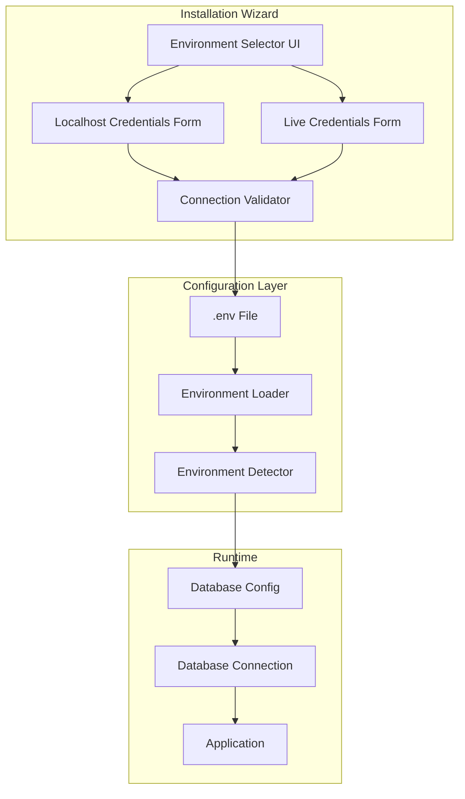
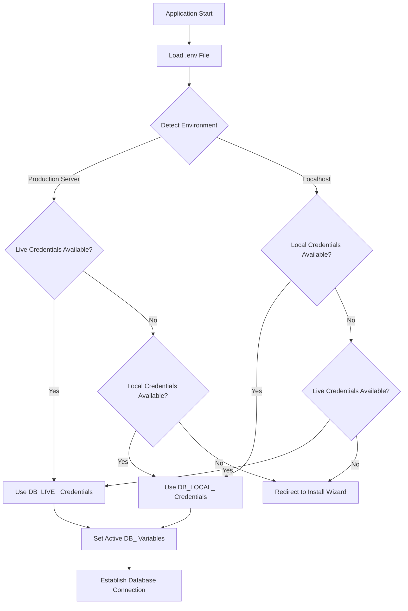

# Design Document: Dual-Environment Setup

## Overview

This design implements a dual-environment configuration system that allows the installation wizard to configure both localhost and live database credentials. The system automatically detects the current environment and uses the appropriate credentials, enabling a seamless "git push and go live" workflow.

The key architectural principle is that the same codebase should work on both localhost (development) and production (Hostinger) without manual configuration file changes after deployment.

## Architecture

### High-Level Architecture



### Environment Detection Flow



## Components and Interfaces

### 1. InstallationService Extensions

Extend the existing `InstallationService` class with dual-environment support:

```php
interface DualEnvironmentConfigInterface {
    /**
     * Save credentials for a specific environment
     * @param string $environment 'local' or 'live'
     * @param array $credentials Database credentials
     * @return bool Success status
     */
    public function saveEnvironmentCredentials(string $environment, array $credentials): bool;
    
    /**
     * Get credentials for a specific environment
     * @param string $environment 'local' or 'live'
     * @return array|null Credentials or null if not configured
     */
    public function getEnvironmentCredentials(string $environment): ?array;
    
    /**
     * Check if credentials exist for an environment
     * @param string $environment 'local' or 'live'
     * @return bool
     */
    public function hasEnvironmentCredentials(string $environment): bool;
    
    /**
     * Get the active environment based on detection
     * @return string 'local' or 'live'
     */
    public function getActiveEnvironment(): string;
    
    /**
     * Resolve and set active database credentials
     * @return array Active credentials
     */
    public function resolveActiveCredentials(): array;
}
```

### 2. Environment Configuration Manager

New class to handle environment-specific configuration:

```php
class EnvironmentConfigManager {
    private const LOCAL_PREFIX = 'DB_LOCAL_';
    private const LIVE_PREFIX = 'DB_LIVE_';
    private const ACTIVE_PREFIX = 'DB_';
    
    /**
     * Write dual-environment configuration to .env file
     */
    public function writeDualConfig(
        ?array $localCredentials, 
        ?array $liveCredentials
    ): bool;
    
    /**
     * Read credentials for a specific environment
     */
    public function readEnvironmentCredentials(string $environment): ?array;
    
    /**
     * Resolve which credentials to use based on environment detection
     */
    public function resolveCredentials(): array;
    
    /**
     * Update the active DB_ variables in .env
     */
    public function setActiveCredentials(string $environment): bool;
}
```

### 3. Database Configuration Step UI

Enhanced UI component for the database configuration step:

```
┌─────────────────────────────────────────────────────────────┐
│  Step 1: Database Configuration                              │
├─────────────────────────────────────────────────────────────┤
│                                                              │
│  Environment Selection                                       │
│  ┌─────────────────────────────────────────────────────────┐│
│  │ ○ Localhost (Development)                               ││
│  │   Configure for local development (XAMPP, MAMP, etc.)   ││
│  │                                                          ││
│  │ ○ Live Server (Production)                              ││
│  │   Configure for production hosting (Hostinger, etc.)    ││
│  └─────────────────────────────────────────────────────────┘│
│                                                              │
│  [Localhost Credentials Form - shown when Localhost selected]│
│  ┌─────────────────────────────────────────────────────────┐│
│  │ Host: [localhost_______]  Port: [3306__]                ││
│  │ Database: [____________]                                 ││
│  │ Username: [____________]  Password: [____________]       ││
│  │ Unix Socket: [_________] (optional)                      ││
│  │                                                          ││
│  │ [Test Connection]  Status: ✓ Connected                   ││
│  └─────────────────────────────────────────────────────────┘│
│                                                              │
│  ┌─────────────────────────────────────────────────────────┐│
│  │ ☑ Also configure Live credentials (optional)            ││
│  └─────────────────────────────────────────────────────────┘│
│                                                              │
│  [Live Credentials Form - shown when checkbox checked]       │
│  ┌─────────────────────────────────────────────────────────┐│
│  │ Host: [____________]  Port: [3306__]                    ││
│  │ Database: [____________]                                 ││
│  │ Username: [____________]  Password: [____________]       ││
│  │                                                          ││
│  │ [Test Connection]  Status: Not tested                    ││
│  └─────────────────────────────────────────────────────────┘│
│                                                              │
│                              [Save & Continue →]             │
└─────────────────────────────────────────────────────────────┘
```

## Data Models

### Environment Configuration Structure (.env)

```ini
# =============================================================================
# DUAL ENVIRONMENT DATABASE CONFIGURATION
# =============================================================================
# The system automatically detects the environment and uses appropriate credentials.
# - On localhost: Uses DB_LOCAL_* credentials
# - On production: Uses DB_LIVE_* credentials (if available, else falls back to local)
# To force localhost credentials on any environment, comment out or remove DB_LIVE_* values.

# -----------------------------------------------------------------------------
# ACTIVE DATABASE CREDENTIALS (Auto-populated based on environment)
# -----------------------------------------------------------------------------
DB_HOST=localhost
DB_PORT=3306
DB_NAME=karyalay_portal
DB_USER=root
DB_PASS=
DB_UNIX_SOCKET=

# -----------------------------------------------------------------------------
# LOCALHOST CREDENTIALS (Development Environment)
# -----------------------------------------------------------------------------
DB_LOCAL_HOST=localhost
DB_LOCAL_PORT=3306
DB_LOCAL_NAME=karyalay_portal
DB_LOCAL_USER=root
DB_LOCAL_PASS=
DB_LOCAL_UNIX_SOCKET=/Applications/XAMPP/xamppfiles/var/mysql/mysql.sock

# -----------------------------------------------------------------------------
# LIVE CREDENTIALS (Production Environment)
# -----------------------------------------------------------------------------
# Leave empty if not yet configured for production
DB_LIVE_HOST=
DB_LIVE_PORT=3306
DB_LIVE_NAME=
DB_LIVE_USER=
DB_LIVE_PASS=
DB_LIVE_UNIX_SOCKET=
```

### Session Data Structure for Wizard

```php
$_SESSION['wizard_data'] = [
    1 => [ // Database step
        'selected_environment' => 'local', // 'local' or 'live'
        'configure_both' => false,
        'local' => [
            'host' => 'localhost',
            'port' => '3306',
            'database' => '',
            'username' => '',
            'password' => '',
            'unix_socket' => '',
            'tested' => false,
            'test_success' => false
        ],
        'live' => [
            'host' => '',
            'port' => '3306',
            'database' => '',
            'username' => '',
            'password' => '',
            'unix_socket' => '',
            'tested' => false,
            'test_success' => false
        ]
    ]
];
```


## Correctness Properties

*A property is a characteristic or behavior that should hold true across all valid executions of a system-essentially, a formal statement about what the system should do. Properties serve as the bridge between human-readable specifications and machine-verifiable correctness guarantees.*

### Property 1: Credential Validation Before Save

*For any* database credentials submitted through the installation wizard or admin settings, the system SHALL test the database connection and only save credentials that pass validation.

**Validates: Requirements 1.3, 4.3**

### Property 2: Environment Detection Accuracy

*For any* server configuration (server name, IP address, domain), the system SHALL correctly classify it as either 'localhost' or 'production' based on the detection criteria (localhost indicators: 127.0.0.1, ::1, localhost, .local, .test, .dev domains).

**Validates: Requirements 2.1**

### Property 3: Credential Resolution Based on Environment

*For any* combination of environment detection result and available credentials:
- If detected as production AND live credentials are valid → use live credentials
- If detected as production AND live credentials are empty/invalid AND local credentials are valid → use local credentials
- If detected as localhost AND local credentials are valid → use local credentials
- If detected as localhost AND local credentials are empty/invalid AND live credentials are valid → use live credentials

**Validates: Requirements 2.2, 2.3, 2.4, 5.1, 5.3, 8.4**

### Property 4: Credential Prefix Correctness

*For any* credentials written to the .env file, localhost credentials SHALL use the DB_LOCAL_ prefix and live credentials SHALL use the DB_LIVE_ prefix for all database variables (HOST, PORT, NAME, USER, PASS, UNIX_SOCKET).

**Validates: Requirements 1.4, 8.2, 8.3**

### Property 5: Session Data Persistence on Environment Switch

*For any* credentials entered in the wizard, switching between environment options and back SHALL restore the previously entered values for that environment from session storage.

**Validates: Requirements 3.4**

### Property 6: URL Base Resolution

*For any* URL generation request:
- If APP_URL is configured → use APP_URL as base
- If APP_URL is not configured → use detected request host and protocol
- Protocol SHALL match the detected request protocol (HTTP or HTTPS)

**Validates: Requirements 7.1, 7.2, 7.4**

### Property 7: Validation Error Message Specificity

*For any* validation error that occurs during credential submission, the system SHALL return an error message that identifies the specific field and provides actionable guidance.

**Validates: Requirements 6.3**

### Property 8: Config File Update Safety

*For any* credential update operation on an existing .env file, the system SHALL preserve all non-database configuration values and maintain file integrity.

**Validates: Requirements 4.4**

### Property 9: Progression with Valid Credentials

*For any* completion of the database configuration step, progression to the next step SHALL be allowed if and only if at least one credential set (local or live) has been validated successfully.

**Validates: Requirements 1.5**

## Error Handling

### Database Connection Errors

| Error Type | Detection | User Message | Recovery Action |
|------------|-----------|--------------|-----------------|
| Host unreachable | PDOException with connection refused | "Cannot connect to database server at {host}:{port}. Please verify the host and port are correct." | Show troubleshooting tips |
| Invalid credentials | PDOException with access denied | "Database access denied. Please verify username and password." | Highlight username/password fields |
| Database not found | PDOException with unknown database | "Database '{name}' does not exist. Please create it first or check the name." | Provide database creation instructions |
| Socket not found | PDOException with socket error | "Unix socket not found at {path}. Please verify the socket path." | Suggest common socket paths |

### Configuration Write Errors

| Error Type | Detection | User Message | Recovery Action |
|------------|-----------|--------------|-----------------|
| Permission denied | file_put_contents returns false | "Cannot write to configuration file. Please check file permissions." | Show chmod instructions |
| Directory not writable | is_writable check fails | "Configuration directory is not writable." | Show directory permission fix |
| Disk full | Exception during write | "Failed to save configuration. Please check available disk space." | N/A |

### Environment Detection Edge Cases

| Scenario | Detection Result | Rationale |
|----------|------------------|-----------|
| Reverse proxy hiding real IP | Use X-Forwarded-For header | Common in load-balanced setups |
| Docker container | Check for .dockerenv file | Container environments |
| Custom local domain (e.g., myapp.local) | Detect .local suffix | Development convention |
| Localhost with public IP | Prioritize server name over IP | Developer intent |

## Testing Strategy

### Property-Based Testing Library

This implementation will use **PHPUnit** with the **Eris** property-based testing library for PHP.

```bash
composer require --dev giorgiosironi/eris
```

### Test Organization

```
tests/
├── Property/
│   └── Services/
│       ├── EnvironmentConfigManagerPropertyTest.php
│       └── InstallationServiceEnvironmentPropertyTest.php
├── Unit/
│   └── Services/
│       ├── EnvironmentConfigManagerTest.php
│       └── InstallationServiceDualEnvTest.php
└── Integration/
    └── Installation/
        └── DualEnvironmentSetupTest.php
```

### Property-Based Test Requirements

- Each property-based test MUST run a minimum of 100 iterations
- Each property-based test MUST be tagged with a comment referencing the correctness property: `**Feature: dual-environment-setup, Property {number}: {property_text}**`
- Each correctness property MUST be implemented by a SINGLE property-based test

### Unit Test Coverage

Unit tests will cover:
- Environment detection with various server configurations
- Credential prefix generation
- .env file parsing and writing
- Session data management for wizard state
- URL generation with various APP_URL configurations

### Integration Test Coverage

Integration tests will verify:
- Complete installation wizard flow with dual credentials
- Environment switching during wizard
- Post-installation credential updates
- Redirect behavior after installation

