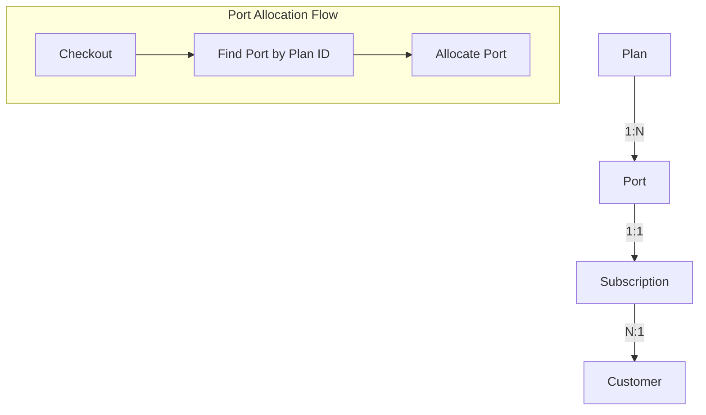
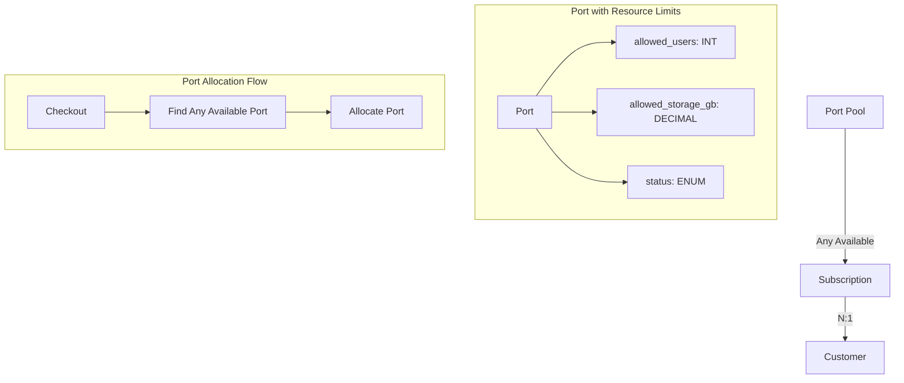
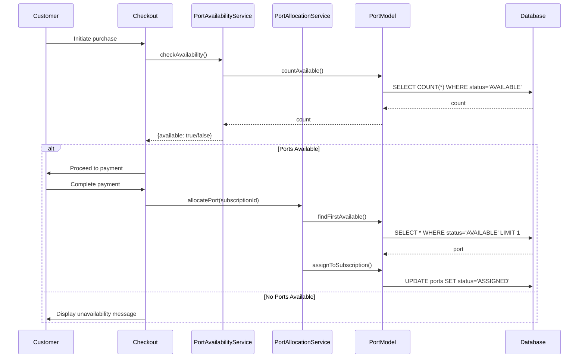

# Design Document: Port Restructuring

## Overview

This design document outlines the technical approach for restructuring the port management system to decouple ports from plans and introduce resource limits (allowed_users and allowed_storage_gb) directly on ports. The changes span database schema, model layer, service layer, and admin/customer UI components.

The key architectural change is removing the plan_id foreign key from ports, making ports a generic resource pool that can be allocated to any subscription regardless of plan type. Resource limits move from being implicit (based on plan) to explicit (stored on each port).

## Architecture

### Current Architecture



### New Architecture



### Component Interaction



## Components and Interfaces

### Database Layer

#### Migration: 035_restructure_ports_table.sql

Adds new columns and removes plan association:

```sql
-- Add resource limit columns
ALTER TABLE ports ADD COLUMN allowed_users INT NOT NULL DEFAULT 1;
ALTER TABLE ports ADD COLUMN allowed_storage_gb DECIMAL(10,2) NOT NULL DEFAULT 1.00;

-- Remove plan association
ALTER TABLE ports DROP FOREIGN KEY ports_ibfk_1;
ALTER TABLE ports DROP COLUMN plan_id;

-- Update indexes
DROP INDEX idx_plan_id ON ports;
```

### Model Layer

#### Port Model Changes

**Removed Methods:**
- `findByPlanId(string $planId)` - No longer needed
- `findAvailableByPlanId(string $planId)` - Replaced with plan-agnostic version
- `countAvailableByPlanId(string $planId)` - Replaced with plan-agnostic version

**Modified Methods:**
- `create(array $data)` - Remove plan_id, add allowed_users and allowed_storage_gb
- `update(string $id, array $data)` - Remove plan_id from allowed fields, add new fields
- `findAll(array $filters)` - Remove plan_id filter, add resource limit filters

**New Methods:**
- `findAvailable(int $limit = 1): array` - Find available ports without plan constraint
- `countAvailable(): int` - Count all available ports
- `findByResourceLimits(int $minUsers, float $minStorage): array` - Filter by resource limits

**Interface:**

```php
interface PortModelInterface {
    public function create(array $data): array|false;
    public function findById(string $id): array|false;
    public function findBySubscriptionId(string $subscriptionId): array|false;
    public function findAvailable(int $limit = 1): array;
    public function countAvailable(): int;
    public function update(string $id, array $data): bool;
    public function delete(string $id): bool;
    public function findAll(array $filters = [], int $limit = 100, int $offset = 0): array;
    public function assignToSubscription(string $id, string $subscriptionId, string $customerId, string $assignedAt): bool;
    public function release(string $id): bool;
}
```

### Service Layer

#### PortService Changes

**Modified Methods:**
- `createPort(array $data)` - Validate allowed_users >= 1 and allowed_storage_gb >= 0.1
- `updatePort(string $portId, array $data)` - Same validation for resource limits
- `getAvailablePorts()` - Remove planId parameter

**Validation Rules:**
- `allowed_users`: Required, integer, minimum value 1
- `allowed_storage_gb`: Required, decimal, minimum value 0.1

#### PortAvailabilityService Changes

**Modified Methods:**
- `checkAvailability()` - Remove planId parameter, check global availability
- `hasAvailablePorts()` - Remove planId parameter
- `getAvailablePortsCount()` - Remove planId parameter
- `validateCheckout()` - Remove planId parameter

#### PortAllocationService Changes

**Modified Methods:**
- `allocatePortToSubscription(string $subscriptionId)` - Find any available port instead of plan-specific
- `hasAvailablePorts()` - Remove planId parameter
- `getAvailablePortsCount()` - Remove planId parameter

### Admin UI Layer

#### admin/ports.php (List Page)

**Changes:**
- Remove "Plan" column from table
- Add "Users" column showing allowed_users
- Add "Storage" column showing allowed_storage_gb formatted as "X GB"
- Remove plan filter dropdown
- Add minimum users filter input
- Add minimum storage filter input

#### admin/ports/new.php (Create Page)

**Changes:**
- Remove plan_id dropdown field
- Add allowed_users number input (required, min=1)
- Add allowed_storage_gb number input (required, min=0.1, step=0.01)

#### admin/ports/edit.php (Edit Page)

**Changes:**
- Remove plan_id dropdown field
- Add allowed_users number input (required, min=1)
- Add allowed_storage_gb number input (required, min=0.1, step=0.01)

#### admin/ports/import.php (CSV Import)

**Changes:**
- Remove plan_id from required/accepted columns
- Add allowed_users to accepted columns (required)
- Add allowed_storage_gb to accepted columns (required)
- Validate resource limits during import

### Customer UI Layer

#### app/subscription.php

**Changes:**
- Display port's allowed_users value
- Display port's allowed_storage_gb value

#### app/my-port.php

**Changes:**
- Add "Resource Limits" section
- Display allowed_users with label "Maximum Users"
- Display allowed_storage_gb with label "Storage Limit"

## Data Models

### Port Entity (Updated)

| Field | Type | Constraints | Description |
|-------|------|-------------|-------------|
| id | CHAR(36) | PRIMARY KEY | UUID identifier |
| instance_url | VARCHAR(255) | NOT NULL, UNIQUE | Instance URL |
| port_number | INT | NULL | Optional port number |
| db_host | VARCHAR(255) | NULL | Database host |
| db_name | VARCHAR(255) | NULL | Database name |
| db_username | VARCHAR(255) | NULL | Database username |
| db_password | VARCHAR(255) | NULL | Database password (encrypted) |
| allowed_users | INT | NOT NULL, DEFAULT 1 | Maximum users allowed |
| allowed_storage_gb | DECIMAL(10,2) | NOT NULL, DEFAULT 1.00 | Storage limit in GB |
| status | ENUM | NOT NULL, DEFAULT 'AVAILABLE' | AVAILABLE, RESERVED, ASSIGNED, DISABLED |
| assigned_customer_id | CHAR(36) | NULL, FK | Assigned customer |
| assigned_subscription_id | CHAR(36) | NULL, FK | Assigned subscription |
| assigned_at | TIMESTAMP | NULL | Assignment timestamp |
| server_region | VARCHAR(50) | NULL | Server region |
| notes | TEXT | NULL | Admin notes |
| setup_instructions | TEXT | NULL | Customer setup instructions |
| created_at | TIMESTAMP | DEFAULT CURRENT_TIMESTAMP | Creation timestamp |
| updated_at | TIMESTAMP | ON UPDATE CURRENT_TIMESTAMP | Last update timestamp |

### Removed Fields
- `plan_id` - No longer needed as ports are plan-agnostic


## Correctness Properties

*A property is a characteristic or behavior that should hold true across all valid executions of a system-essentially, a formal statement about what the system should do. Properties serve as the bridge between human-readable specifications and machine-verifiable correctness guarantees.*

Based on the acceptance criteria analysis, the following correctness properties must be validated:

### Property 1: Port creation requires resource limits

*For any* port creation request, if allowed_users or allowed_storage_gb is not provided, the system should reject the creation and return a validation error.

**Validates: Requirements 1.1**

### Property 2: Port resource limits are editable

*For any* existing port and any valid resource limit values (allowed_users >= 1, allowed_storage_gb >= 0.1), updating the port with new values should persist those values and return the updated port.

**Validates: Requirements 1.2**

### Property 3: Invalid allowed_users values are rejected

*For any* port creation or update request with allowed_users < 1 (including 0 and negative integers), the system should reject the request and return a validation error without modifying the database.

**Validates: Requirements 1.4**

### Property 4: Invalid allowed_storage_gb values are rejected

*For any* port creation or update request with allowed_storage_gb < 0.1 (including 0, 0.09, and negative decimals), the system should reject the request and return a validation error without modifying the database.

**Validates: Requirements 1.5**

### Property 5: Port creation succeeds without plan_id

*For any* valid port data containing instance_url, allowed_users, and allowed_storage_gb (but no plan_id), the system should successfully create the port and return the created port data.

**Validates: Requirements 2.1**

### Property 6: Port filtering by minimum users returns correct results

*For any* set of ports with varying allowed_users values and any minimum user filter value, the filtered results should contain only ports where allowed_users >= the filter value.

**Validates: Requirements 3.2**

### Property 7: Port filtering by minimum storage returns correct results

*For any* set of ports with varying allowed_storage_gb values and any minimum storage filter value, the filtered results should contain only ports where allowed_storage_gb >= the filter value.

**Validates: Requirements 3.3**

### Property 8: CSV import validates resource limits

*For any* CSV import data containing rows with invalid resource limits (allowed_users < 1 or allowed_storage_gb < 0.1), the system should reject those rows and report validation errors.

**Validates: Requirements 3.5**

### Property 9: Availability check returns true when available ports exist

*For any* port pool state, the availability check should return true if and only if at least one port has status = 'AVAILABLE'.

**Validates: Requirements 4.1**

### Property 10: Port allocation assigns and updates status atomically

*For any* subscription requiring port allocation when available ports exist, the allocation should assign exactly one available port to the subscription, update the port status to 'ASSIGNED', and link the port to the subscription.

**Validates: Requirements 4.3, 4.4**

### Property 11: Resource limits display on customer pages

*For any* subscription with an assigned port, viewing the subscription details or "My Port" page should display the port's allowed_users and allowed_storage_gb values.

**Validates: Requirements 5.1, 5.2, 5.3**

## Error Handling

### Validation Errors

| Error Condition | Error Code | Message |
|-----------------|------------|---------|
| allowed_users < 1 | INVALID_USERS_LIMIT | "Allowed users must be at least 1" |
| allowed_storage_gb < 0.1 | INVALID_STORAGE_LIMIT | "Allowed storage must be at least 0.1 GB" |
| Missing allowed_users | MISSING_USERS_LIMIT | "Allowed users is required" |
| Missing allowed_storage_gb | MISSING_STORAGE_LIMIT | "Allowed storage is required" |
| Duplicate instance_url | DUPLICATE_INSTANCE | "Port with this instance URL already exists" |

### Allocation Errors

| Error Condition | Error Code | Message |
|-----------------|------------|---------|
| No available ports | NO_AVAILABLE_PORTS | "No available ports. Please contact support." |
| Subscription already has port | ALREADY_ASSIGNED | "Subscription already has an assigned port" |
| Port already assigned | PORT_UNAVAILABLE | "Port is no longer available" |

### Migration Errors

| Error Condition | Recovery Action |
|-----------------|-----------------|
| Column already exists | Skip column creation, log warning |
| Foreign key doesn't exist | Skip constraint removal, log warning |
| Data loss risk | Abort migration, require manual intervention |

## Testing Strategy

### Property-Based Testing Library

This project will use **PHPUnit** with the **Eris** library for property-based testing in PHP. Eris provides generators for creating random test data and shrinking capabilities for finding minimal failing examples.

Installation:
```bash
composer require --dev giorgiosironi/eris
```

### Test Configuration

Each property-based test should run a minimum of 100 iterations to ensure adequate coverage of the input space.

### Test Annotation Format

Each property-based test must be tagged with a comment explicitly referencing the correctness property:
```php
/**
 * **Feature: port-restructuring, Property 1: Port creation requires resource limits**
 */
```

### Unit Tests

Unit tests will cover:
- Port model CRUD operations with new fields
- PortService validation logic
- PortAvailabilityService availability checks
- PortAllocationService allocation logic
- Admin form validation
- CSV import parsing

### Property-Based Tests

Each correctness property will have a corresponding property-based test:

1. **Property 1 Test**: Generate random port data without resource limits, verify rejection
2. **Property 2 Test**: Generate random ports and valid update values, verify persistence
3. **Property 3 Test**: Generate random invalid allowed_users values (< 1), verify rejection
4. **Property 4 Test**: Generate random invalid allowed_storage_gb values (< 0.1), verify rejection
5. **Property 5 Test**: Generate random valid port data without plan_id, verify success
6. **Property 6 Test**: Generate random port sets and filter values, verify filtering correctness
7. **Property 7 Test**: Generate random port sets and storage filters, verify filtering correctness
8. **Property 8 Test**: Generate random CSV data with invalid limits, verify validation errors
9. **Property 9 Test**: Generate random port pool states, verify availability check correctness
10. **Property 10 Test**: Generate random allocation scenarios, verify atomic assignment
11. **Property 11 Test**: Generate random subscriptions with ports, verify display contains limits

### Integration Tests

Integration tests will verify:
- End-to-end port creation through admin UI
- End-to-end checkout flow with port allocation
- Database migration execution
- CSV import with valid and invalid data

### Test Data Generators

```php
// Generator for valid allowed_users
$validUsersGenerator = Generator\choose(1, 1000);

// Generator for invalid allowed_users
$invalidUsersGenerator = Generator\oneOf(
    Generator\constant(0),
    Generator\neg(Generator\pos())
);

// Generator for valid allowed_storage_gb
$validStorageGenerator = Generator\map(
    function($n) { return round($n / 10, 2); },
    Generator\choose(1, 10000)
);

// Generator for invalid allowed_storage_gb
$invalidStorageGenerator = Generator\oneOf(
    Generator\constant(0),
    Generator\constant(0.09),
    Generator\neg(Generator\pos())
);

// Generator for port data
$portDataGenerator = Generator\associative([
    'instance_url' => Generator\suchThat(
        function($s) { return strlen($s) > 0; },
        Generator\string()
    ),
    'allowed_users' => $validUsersGenerator,
    'allowed_storage_gb' => $validStorageGenerator,
    'status' => Generator\elements(['AVAILABLE', 'RESERVED', 'DISABLED'])
]);
```
